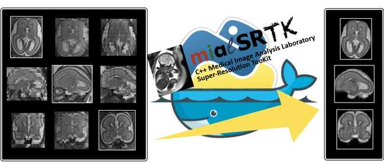
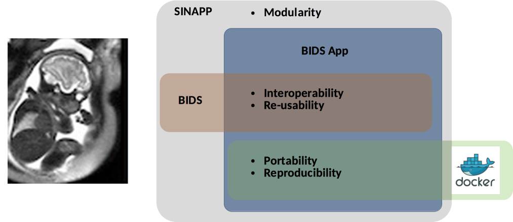
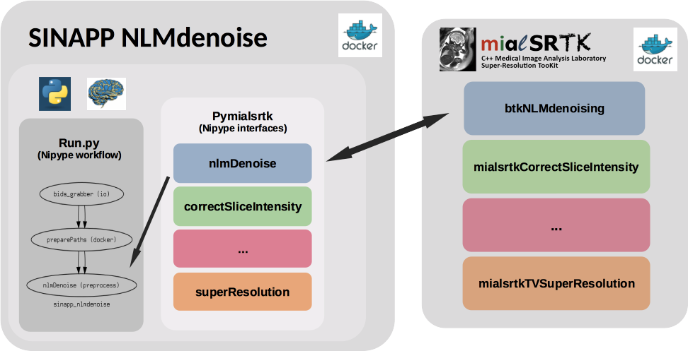

# SuperResMRI



The essence of this project is to develop a modular BIDS App which interfaces with the open-source [Medical Image Analysis Laboratory Super-Resolution ToolKit (MIALSRTK)](https://github.com/sebastientourbier/mialsuperresolutiontoolkit), a set of C++ image processing tools necessary to perform the whole processing pipeline for motion-robust fetal brain super-resolution MRI.

This project is built on standards, tools, and frameworks developed to address the reproducibility and transparency challenges in the neuroimaging field :

- the Brain Imaging Data Structure (BIDS), a standard to organize and describe neuroimaging data,
- the Nipype dataflow library, which provides a common python API to interface with different tools and a workflow engine which control tool execution and record provenance. 
- and the BIDS App framework, which promotes reproducibility and portability. 

It investigates a novel framework, the Self-contained Interfaceable No-nonsense Application (SINAPP) framework, designed to provide modularity and reusability of the pipeline stages within the BIDS App framework. 



### Achievements during the previous Brainhack

#### Brainhack Global 2019 

Project 05:  SINAPP (Modular BIDS App) for Motion-robust Super-Resolution MRI

**Team:** Manik, Olivier, Guillaume and Sébastien 

* See the final 

#### Brainhack Open Geneva 2019 

Project 03: Package a portable and reproducible software for motion-robust MRI super-resolution

* See the final 

**Team:** Seirios, Brenda, Snezana, Niloufar and Sébastien

## Contribution, bug and support

This project is conducted with transparency in mind. It uses GitHub Issues (https://github.com/brainhack-ch/superres-mri/issues) and GitHub pull-request (https://github.com/brainhack-ch/superres-mri/pulls) to manage and discuss bugs and new features. 

## Installation
* Clone this repository:
```
git clone https://github.com/brainhack-ch/superres-mri.git <Your/installation/dir>
```
* Install the `supermri-env` conda environment with all the packages and dependencies:
```
conda env create -f environment.yml
```
* Download the latest version of the mialsuperresolutiontoolkit Docker image:
```
docker pull sebastientourbier/mialsuperresolutiontoolkit:latest
```


## Run the SINAPP example

This example of SINAPP that performs NLM denoising was developed during the BrainHack Global Geneva 2019 and provides a proof of feasibility of the envisioned framework. Its architecture is illustrated by the figure below:



We provide two scripts in `sinapps/nlmdenoise/` that facilitates the built and testing of this example. The script `build_sinapp-core_and_sinapp-nlmdenoise.sh`shows you how we build the sinapp-nlmdenoise docker image. The script `run_sinapp-nlmdenoise.sh` shows you how to execute it. 

**Instructions**

* Edit the path defined by `superes-mri_dir` in `build_sinapp-core_and_sinapp-nlmdenoise.sh` by your `<Your/installation/dir>`.
* Edit the path defined by `bids_dir` in the  `run_sinapp-nlmdenoise.sh` script to the location of your BIDS dataset location (`<Your/BIDS/dir>`)
* In a terminal go to your `<Your/installation/dir>`:
```
cd <Your/installation/dir>
```
* Build the SINAPP:
```
sh build_sinapp-core_and_sinapp-nlmdenoise.sh
```
* Run the SINAPP  on all T2w scans of sub-01 in `<Your/BIDS/dir>`:
```
sh run_sinapp-nlmdenoise.sh
```
Results are generated in `<Your/BIDS/dir>/derivatives/superres-mri/sub-01/nipype/sinapp_nlmdenoise`.

## Want to help with the development of the entire collection of SINAPPs?
Please check the github issue https://github.com/brainhack-ch/superres-mri/issues/7 dedicated to the management, tracking, and discussions about the developement of the SINAPP collection for the MIALSRTK library.

## Running the notebooks

* Go to the notebooks directory in the cloned repo:
```
cd <Your/installation/dir>/notebooks
```

* Activate the conda environment `supermri-env`:
```
conda activate supermri-env
```

* Launch the ipython notebook server:
```
jupyter notebook
```


## License

This project is licensed under the BSD 3-Clause License - see the [LICENSE](LICENSE) file for details

## Contributors
* **Sebastien**
* **Priscille**
* **Hamza**
* **Manik**
* **Olivier**
* **Guillaume**
* **Seirios**
* **Brenda**
* **Snezana**
* **Niloufar**

See also the list of [contributors](https://github.com/brainhack-ch/superres-mri/contributors) who participated in this project.

